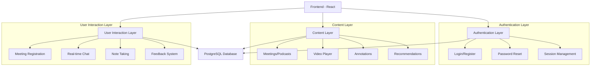
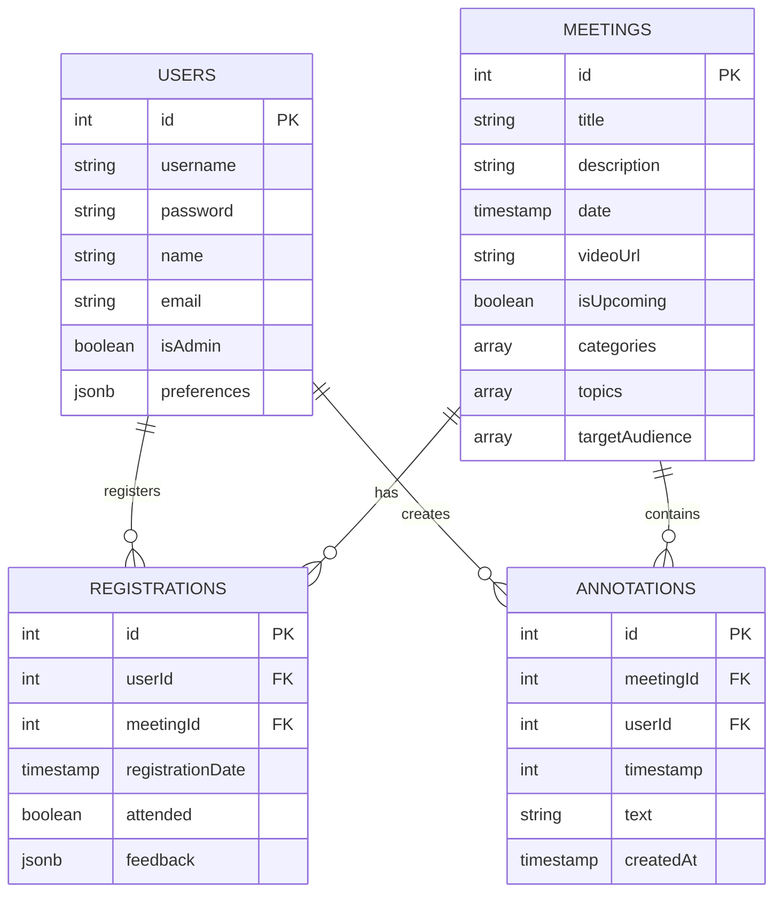

# Syrian Urban Reconstruction Podcast Platform

## Site Architecture & Structure

### Core Components

### Pages Structure

1. **Authentication Page** (`/auth`)
   - Bilingual support (Arabic/English)
   - Login/Register tabs
   - Password reset functionality
   - Welcome information section

2. **Home Page** (`/`)
   - Upcoming meetings section
   - Latest recorded meetings
   - Quick access to recommendations
   - Registration shortcuts

3. **Meetings Page** (`/meetings`)
   - Grid layout with meeting cards
   - Advanced filtering system
   - Personalized recommendations
   - Registration management

4. **Past Meetings** (`/past-meetings`)
   - Video archive
   - Searchable content
   - Meeting annotations
   - Discussion threads

### Design System

#### Color Scheme
- Primary: Black (`hsl(0, 0%, 0%)`)
- Background: Dark theme optimized
- Accent colors: Monochromatic palette
- Text: High contrast for accessibility

#### Typography
- Arabic: Traditional Arabic for headings
- English: System font stack
- Responsive sizing
- Clear hierarchy

#### Components
1. **Navigation**
   - Responsive navbar
   - Language switcher
   - User menu
   - Search functionality

2. **Cards**
   - Meeting cards
   - User profile cards
   - Information cards
   - Video preview cards

3. **Interactive Elements**
   - Custom buttons
   - Form inputs
   - Dropdown menus
   - Modal dialogs

### Database Schema

### Technical Stack

1. **Frontend**
   - React with TypeScript
   - TanStack Query for data fetching
   - Shadcn UI components
   - Tailwind CSS for styling
   - React Hook Form for forms
   - Zod for validation

2. **Backend**
   - Express.js server
   - PostgreSQL database
   - Drizzle ORM
   - Passport.js authentication
   - WebSocket for real-time features

3. **Infrastructure**
   - Replit hosting
   - PostgreSQL database
   - Email service integration
   - Video hosting integration

### Performance Optimizations

1. **Frontend**
   - Code splitting
   - Lazy loading of components
   - Optimized image loading
   - Caching strategies

2. **Backend**
   - Database indexing
   - Query optimization
   - Caching layer
   - Rate limiting

### Security Measures

1. **Authentication**
   - JWT token-based auth
   - Password hashing
   - Session management
   - CSRF protection

2. **Data Protection**
   - Input validation
   - SQL injection prevention
   - XSS protection
   - Rate limiting
