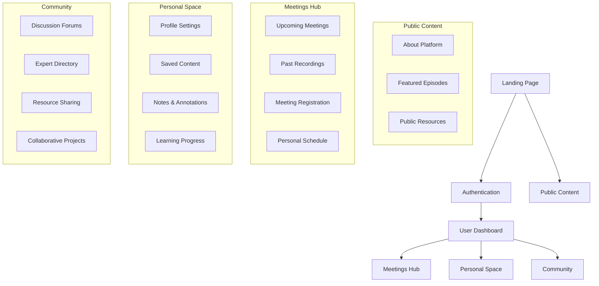
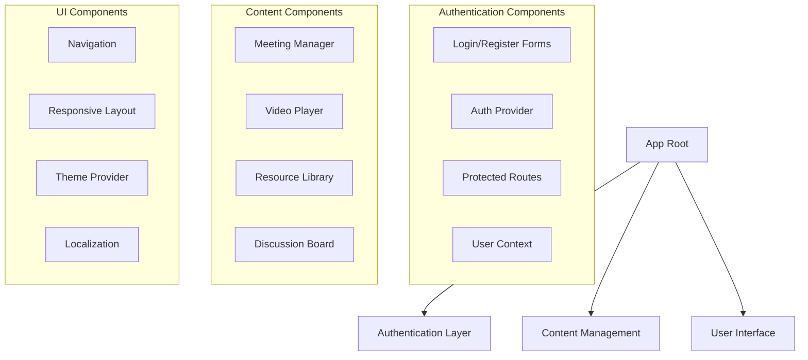
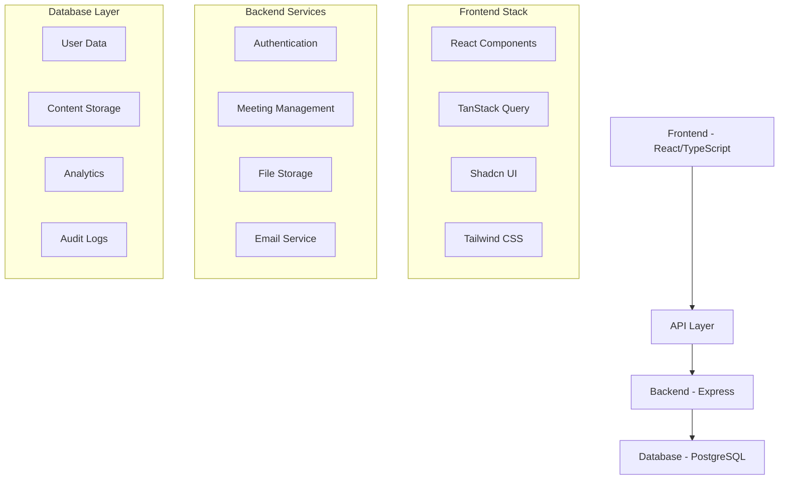

# Syrian Urban Reconstruction Podcast Platform - Detailed Structure

## 1. Site Overview

### Purpose
A specialized platform facilitating community dialogue and knowledge sharing about Syrian urban development through:
- Multilingual podcast content (Arabic/English)
- Interactive community features
- Educational resources
- Collaborative tools

## 2. Site Map



## 3. Component Architecture



## 4. Technical Infrastructure



## 5. Key Features

### 5.1 Content Management
- Podcast episode organization
- Video content hosting
- Resource library
- Multilingual support

### 5.2 User Engagement
- Meeting registration system
- Interactive discussions
- Note-taking capabilities
- Progress tracking

### 5.3 Community Features
- Expert networking
- Knowledge sharing
- Collaborative projects
- Resource exchange

### 5.4 Administrative Tools
- Content moderation
- User management
- Analytics dashboard
- Report generation

## 6. Design System

### 6.1 Typography
- Arabic UI: Traditional Arabic
- English UI: System font stack
- Heading Hierarchy:
  - H1: 2.5rem (40px)
  - H2: 2rem (32px)
  - H3: 1.75rem (28px)
  - Body: 1rem (16px)

### 6.2 Color Palette
```css
:root {
  /* Primary Colors */
  --primary: hsl(0, 0%, 0%);
  --primary-foreground: hsl(0, 0%, 100%);
  
  /* Background Colors */
  --background: hsl(0, 0%, 100%);
  --background-secondary: hsl(0, 0%, 98%);
  
  /* Accent Colors */
  --accent: hsl(0, 0%, 20%);
  --accent-foreground: hsl(0, 0%, 98%);
  
  /* Semantic Colors */
  --success: hsl(120, 100%, 27%);
  --warning: hsl(45, 100%, 51%);
  --error: hsl(0, 100%, 50%);
  
  /* UI Elements */
  --border: hsl(0, 0%, 80%);
  --ring: hsl(0, 0%, 40%);
}
```

### 6.3 Components
- Consistent spacing system
- Responsive breakpoints
- Accessible UI elements
- RTL support

## 7. Performance Optimizations

### 7.1 Frontend
- Code splitting
- Lazy loading
- Image optimization
- Caching strategies

### 7.2 Backend
- Query optimization
- Connection pooling
- Rate limiting
- Response caching

### 7.3 Database
- Indexing strategy
- Query optimization
- Connection management
- Data archival

## 8. Security Measures

### 8.1 Authentication
- JWT-based auth
- Session management
- Password policies
- 2FA support

### 8.2 Data Protection
- Input sanitization
- XSS prevention
- CSRF protection
- Rate limiting

### 8.3 Privacy
- Data encryption
- User consent
- Privacy controls
- Data retention

## 9. Monitoring & Analytics

### 9.1 Performance Metrics
- Page load times
- API response times
- Error rates
- Resource usage

### 9.2 User Analytics
- Engagement metrics
- Feature usage
- Content popularity
- User feedback

### 9.3 System Health
- Server monitoring
- Database performance
- Cache hit rates
- Error tracking
